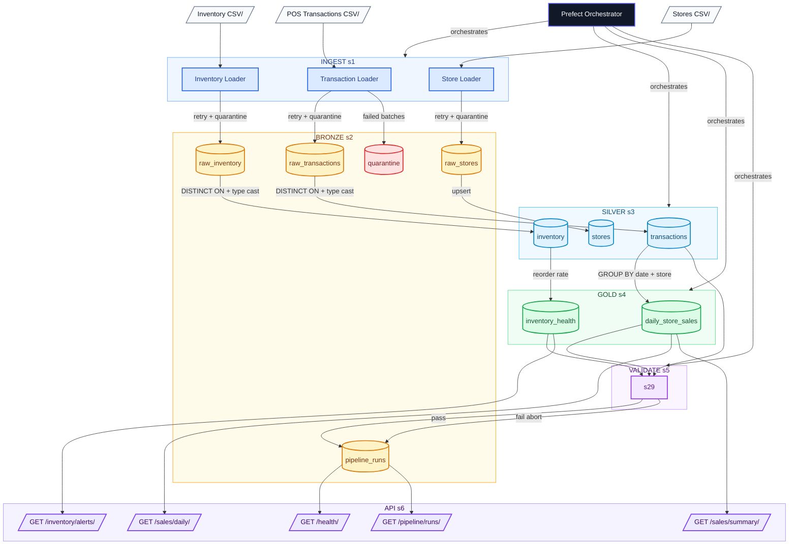

# Retail & Operations Intelligence Platform

[](https://github.com/skeptre/retail-ops-platform/actions/workflows/ci.yml)
[](https://python.org)
[](https://postgresql.org)
[](https://prefect.io)
[](https://fastapi.tiangolo.com)
[](https://github.com/skeptre/retail-ops-platform)

A production-patterned ELT data platform for a multi-location retail business.
Demonstrates the full data engineering lifecycle: ingestion, transformation,
quality validation, orchestration, and analytics serving.

---

## Architecture



**Orchestration:** Prefect flow chains all stages with retries and run metadata logging.  
**Validation:** Quality checks run after transformation — error-severity failures abort the pipeline.  
**Containerisation:** Docker Compose runs PostgreSQL and pgAdmin locally.

---

## Quick Start

**Prerequisites:** Docker Desktop, Python 3.11+, Git

```bash
# 1. Clone
git clone https://github.com/skeptre/retail-ops-platform
cd retail-ops-platform

# 2. Create virtual environment
python -m venv .venv
.venv\Scripts\activate        # Windows
source .venv/bin/activate     # Mac/Linux

# 3. Install dependencies
pip install -r requirements.txt

# 4. Configure environment
copy .env.example .env        # Windows
cp .env.example .env          # Mac/Linux
# Edit .env with your values

# 5. Start infrastructure
cd docker && docker compose up -d && cd ..

# 6. Generate mock data
python -m src.generate.stores
python -m src.generate.inventory
python -m src.generate.transactions

# 7. Run the pipeline
python -m src.orchestrate.pipeline_flow

# 8. Start the API
uvicorn src.api.main:app --reload
# Open: http://localhost:8000/docs
```

---

## Design Decisions

### ELT over ETL

Data is loaded into PostgreSQL in raw TEXT format first (bronze layer), then
transformed in-database using SQL. This means raw data is always preserved and
transformations are replayable without re-ingesting. If transformation logic
changes, you re-run the SQL against the same bronze data. ETL would transform
before loading — simpler, but you lose the audit trail.

### Why PostgreSQL over a Data Warehouse

For a portfolio MVP, PostgreSQL demonstrates the same SQL patterns used in
BigQuery, Redshift, and Snowflake at no cost. The medallion schema, upsert
patterns, and quality checks transfer directly to any cloud warehouse. At scale,
the upgrade path is: partition bronze tables by date, move raw files to S3/GCS,
replace PostgreSQL with a columnar warehouse, and add dbt for transformations.

### Medallion Architecture (Bronze / Silver / Gold)

- **Bronze** — raw, append-only, all columns TEXT. Load never fails due to type mismatch.
- **Silver** — typed, validated, deduplicated. One clean record per business entity.
- **Gold** — pre-aggregated for fast API queries. Rebuilt on each pipeline run.

### Idempotency

Every transformation uses `ON CONFLICT DO NOTHING` or `ON CONFLICT DO UPDATE`.
Re-running the pipeline any number of times produces the same result without
duplicating data. This is non-negotiable for scheduled batch pipelines.

### Quarantine Pattern

Records that fail silver transformation checks are flagged with
`_is_quarantined = TRUE` and a reason in `bronze.raw_transactions`. Nothing is
silently dropped. Failed records are recoverable — if transformation logic is
fixed, you can re-process quarantined rows without re-ingesting from source.

### Retry Logic

The `BaseLoader` class retries failed loads up to 3 times with exponential
backoff (1s, 2s, 4s). This handles transient database connectivity issues
without crashing the pipeline. After all retries fail, the batch is written
to `data/quarantine/` as a CSV for manual inspection.

### Pipeline Run Metadata

Every pipeline run writes a record to `bronze.pipeline_runs` with start time,
finish time, status, and any error message. This makes the platform observable
— you can see the full run history via the `/api/v1/pipeline/runs` endpoint
without digging through logs.

### Gold Layer Caching

Gold tables are materialised tables, not views. The API queries gold directly
so responses are fast even with millions of rows in silver. A view would
re-aggregate on every API request.

---

## Trade-offs and Known Limitations

| Limitation | Impact | Upgrade Path |
| --- | --- | --- |
| Batch (daily) not streaming | Data is up to 24h stale | Add Kafka/Kinesis for real-time ingestion |
| Full refresh on gold | Slow at very large scale | Incremental refresh with watermark column |
| Batch-level quarantine | All rows in a failed batch quarantined together | Row-level quarantine with pre-validation |
| No API authentication | Endpoints are open | Add OAuth2/API key middleware |
| PostgreSQL not columnar | Slow analytics at 100M+ rows | Migrate to BigQuery/Redshift/Snowflake |
| Cast safety in SQL | Bad types can error before regex guard runs | Pre-filter with CTE before casting |

---

## Data Quality Checks

| Check | Type | Threshold |
| --- | --- | --- |
| No negative quantities in silver | Error | 0 |
| No future-dated transactions | Error | 0 |
| Quarantine rate under 10% | Error | <10% |
| Silver transactions not empty | Error | ≥1 row |
| Gold daily sales populated | Warning | ≥1 row |
| All stores have at least one sale | Warning | 0 orphans |

Error-severity failures abort the pipeline and mark the run as `failed`.
Warning-severity failures log but allow the run to complete.

---

## API Reference

| Method | Endpoint | Description |
| --- | --- | --- |
| GET | `/health` | Platform health and last pipeline run status |
| GET | `/api/v1/sales/daily` | Daily sales by store with optional filters |
| GET | `/api/v1/sales/summary` | Revenue summary for 7d, 30d, or 90d period |
| GET | `/api/v1/inventory/alerts` | Products currently below reorder point |
| GET | `/api/v1/inventory/health-snapshot` | Reorder rate per store |
| GET | `/api/v1/pipeline/runs` | Recent pipeline run history |

Interactive docs: `http://localhost:8000/docs`

---

## Project Structure

```text
retail-ops-platform/
├── docker/                  # Docker Compose and PostgreSQL init
├── src/
│   ├── generate/            # Mock data generators
│   ├── ingest/              # Bronze layer loaders with retry/quarantine
│   ├── transform/           # Silver and gold SQL transformations
│   ├── validate/            # Data quality checks
│   ├── orchestrate/         # Prefect pipeline flow
│   ├── api/                 # FastAPI app and routers
│   └── db/                  # Database connection
├── tests/                   # Pytest suite (20 tests)
├── data/
│   ├── raw/                 # Generated CSV source files
│   └── quarantine/          # Failed records
└── docs/                    # Architecture diagrams and screenshots
```

---

## Testing

```bash
# Run all tests
pytest tests/ -v

# With coverage report
pytest tests/ --cov=src --cov-report=term-missing
```

**Coverage targets:** >80% on `src/transform/` and `src/validate/`

---

## Scalability Notes

This platform is intentionally scoped as a batch ELT MVP. Here is how each
component would evolve at production scale:

- **Ingestion** — Replace CSV files with S3/GCS event triggers. Use Spark or
  Beam for parallel ingestion of large files.
- **Storage** — Partition bronze tables by ingestion date. Migrate to a
  columnar warehouse (BigQuery, Redshift, Snowflake) for analytics workloads.
- **Transformations** — Replace raw SQL scripts with dbt for version-controlled,
  tested, documented transformations.
- **Orchestration** — Deploy Prefect with a dedicated server and workers instead
  of the temporary local server. Use cloud-managed orchestration (Cloud Composer,
  MWAA) for production.
- **Validation** — Replace custom quality checks with Great Expectations for
  richer validation rules and HTML reports.
- **API** — Add authentication (OAuth2/API keys), rate limiting, and response
  caching. Deploy behind a load balancer.

---

## Stack

| Component | Technology |
| --- | --- |
| Language | Python 3.11 |
| Database | PostgreSQL 16 |
| Orchestration | Prefect 3.x |
| API | FastAPI + Uvicorn |
| Data processing | Pandas, SQLAlchemy |
| Testing | Pytest |
| Containerisation | Docker + Docker Compose |
| Mock data | Faker |
